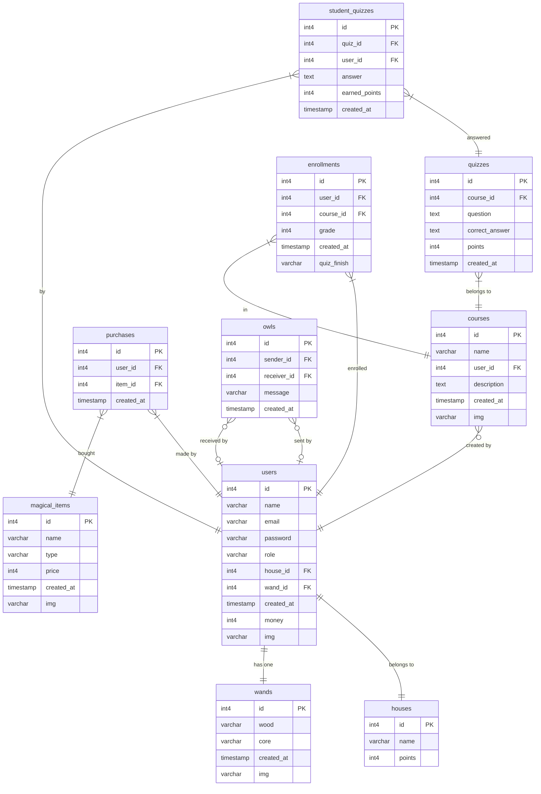

# **Project Overview**  
Welcome to the Hogwarts Student Management System , an innovative platform that blends student management with e-commerce functionality. Designed through a creative and immersive storyline , this project makes learning more engaging and productive.
This project is built entirely using PHP (no frameworks) and follows the MVC pattern within a monolithic architecture .

## **A New Era at Hogwarts**  

### **The Story**  
After the fall of the Dark Lord, Hogwarts entered a new era of **innovation and modernization**. Under **Professor McGonagall’s leadership**, the wizarding world embraced new ideas, blending ancient magic with modern technology.  

As part of this transformation, Hogwarts introduced a groundbreaking subject: **Programming**. Now, young witches and wizards can master the art of coding alongside their magical studies.  

You are among the first graduates of this **new-age Hogwarts curriculum**, and as your final challenge, **Professor McGonagall** has assigned your team a critical task:  

> **Develop an advanced system to manage students, houses, courses, and magical items to ensure Hogwarts remains the finest school of witchcraft and wizardry for generations to come.**  

Even the wizarding world needs a **digital upgrade**!  

## Advanced Features

- Use 3 triggers for : 
  - Update earned points for a student after submitting a quiz , done by comparing their answers with the correct answers.
  - Update the img field in the User entity with an image corresponding to the house they were selected into (e.g., user1.png if house.id = 1), which changes the color of the cat's jacket.
  - Update house points whenever one of its students submits a quiz, so we can determine which house has the most points.
- use some usefull pakages like (respect/validation-JWT-vlucas/phpdotenv-symfony)
- Use Supabase as a PostgreSQL-based serverless backend for secure storage and auto-scaling capabilities. 
- Implement ORM methods like:
getAll(), getOne(), insert(), update(), delete(), getWithJoin(), getWith2Joins()
inside the Database class : [Database.php](app/Core/Database.php)
- Make awesome helper methods you can see it here [FunctionClass](helpers/Functions.php)
- Apply routing system and middelware for (guest,student,professor,headmster)
---

## **Basic Features**  

### 🏰 **House Assignment**  
- **Sorting Hat Magic** 🧙‍♂️  
  - When a new student registers, the **Sorting Hat** assigns them to one of the four houses:  
    - 🦁 **Gryffindor**  
    - 🐍 **Slytherin**  
    - 🦅 **Ravenclaw**  
    - 🦡 **Hufflepuff**  
- **House Points System**  
  - Students earn points based on **course performance** and challenges. *(A quiz or similar challenge can determine points.)*  

### 📚 **Magical Course Enrollment**  
- **Course Options**  
  - Students can enroll in subjects like:  
    - 🛡 **Defense Against the Dark Arts**  
    - 🧪 **Potions**  
    - ✨ **Transfiguration**  
    - 📖 **Charms**  
- **Interactive Quizzes**  
  - Completing quizzes successfully **earns house points**.  
- **Professor Bonus**  
  - Each course is led by a professor who assigns tasks and quizzes, offering an **extra +5 points per course**.  

### ✨ **Wand Selection & Magical Items**  
- **Wand Assignment**  
  - Upon registration, students receive a **random wand** from Ollivander’s Wand Shop.  
  - *Wand Attributes:*  
    - **Wood Types:** Holly, Yew, Elder, Willow, Hawthorn, Oak  
    - **Core Types:** Phoenix Feather, Dragon Heartstring, Unicorn Hair, Thestral Tail Hair  
- **Magical Items & E-Commerce Store**  
  - Students can **collect or purchase** brooms, potion ingredients, spell books, and other magical items as they progress.  

### 🎓 **Admin Dashboard (For Professors & Headmaster)**  
- **Student & Course Management**  
  - Professors can 
    - **create new course which will be assigned to them only**.  
    - **manage students, make quizzes, and add magical items**.  
- **Full Administrative Control**  
  - **Dumbledore(headmaster)** has **ultimate authority**, capable of overriding any professor’s actions if needed.  
    - can appoint student to professor or retire the professor.
    - can edit professors data or make new courses to them  

### There are some screenshots form website 

if you want to see more vist this [Link](https://drive.google.com/drive/folders/1J3s4oHFzddSGnMe_z5nAaLsMus6UVnvt?usp=sharing)
---

## **Installation & Setup**  
*(To be added)*  

